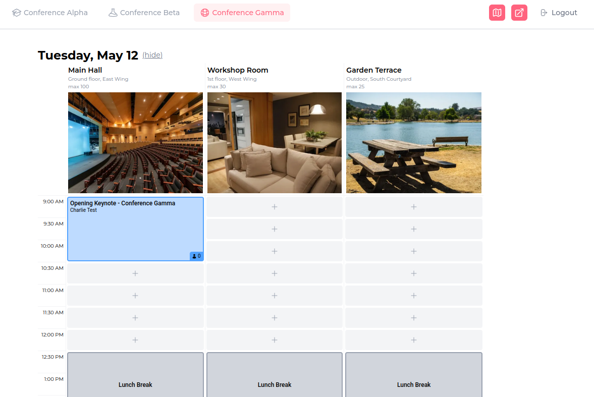

# SchellingBoard

A web app for managing event scheduling — attendees can propose sessions, vote on them, and view the final schedule. Built with Next.js and SQLite.

The name is a tongue-in-cheek reference to [**Schelling points**](<https://en.wikipedia.org/wiki/Focal_point_(game_theory)>) — focal points that people naturally converge on _without_ explicit coordination. SchellingBoard is the ironic opposite: a tool that enables explicit coordination. Attendees propose sessions and vote, creating a concrete consensus that wouldn't emerge on its own.

This is a public open-source fork of [rachelweinberg12/scheduling-app](https://github.com/rachelweinberg12/scheduling-app). Rachel Weinberg, the original author, does not wish to maintain a public open-source project herself but agreed to this fork serving that role. See [LICENSING_HISTORY.md](LICENSING_HISTORY.md) for details.

## Features

- **Session proposals** — attendees submit and browse session ideas
- **Voting** — attendees express interest (interested / maybe / skip) before the schedule is set
- **Scheduling board** — drag sessions onto a time/location grid
- **Event phases** — proposal, voting, and scheduling phases with configurable date ranges
- **Multi-event support** — host multiple events from one deployment
- **Site password protection** — optional single-password gate for the whole app



## Getting Started

### Prerequisites

- Node.js / Bun

### Setup

1. Clone the repo and install dependencies:

   ```bash
   bun install
   ```

2. Create `.env.dev.local` with your database path:

   ```bash
   DATABASE_URL=file:./data.db
   ```

3. Run database migrations:

   ```bash
   bun dev:migrate:up
   ```

4. Seed the development database:

   ```bash
   bun dev:db:reset
   ```

5. Start the dev server:

   ```bash
   bun dev
   ```

   Open [http://localhost:3000](http://localhost:3000) in your browser.

### Next steps

```bash
bun playwright install   # install browser binaries for E2E tests (one-time)
bun test:e2e             # run E2E tests
bun lint                 # lint
bun run                  # list all available scripts
```

### Admin CLI

Until a full admin UI is built ([#368](https://github.com/omarkohl/schellingboard/issues/368)), a terminal CLI is available for managing core records (events, guests, phase dates):

```bash
bun dev:admin
```

This opens an interactive menu to create, edit, and delete events and guests, and to set event phase dates.

To run against a different environment (e.g. production):

```bash
bun set-env.ts production tsx scripts/admin.ts
```

## Environment Variables

### Required

| Variable       | Description                                       |
| -------------- | ------------------------------------------------- |
| `DATABASE_URL` | SQLite database file path (e.g. `file:./data.db`) |

### Optional

| Variable                        | Description                                                                                        |
| ------------------------------- | -------------------------------------------------------------------------------------------------- |
| `SITE_PASSWORD`                 | Enables site-wide password protection. Omit to disable.                                            |
| `AUTH_SECRET`                   | HMAC secret used to sign auth cookies. Required when `SITE_PASSWORD` is set. Use ≥32 random bytes. |
| `NEXT_PUBLIC_FOOTER_RIGHT_HTML` | HTML for the right side of the footer (e.g. links to GitHub or a bug tracker).                     |

`NEXT_PUBLIC_` variables are exposed to the browser; all others are server-side only.

Generate a fresh `AUTH_SECRET`:

```bash
openssl rand -base64 32
```

## Event Phases

Events can progress through three optional phases:

| Phase          | What it enables                                                        |
| -------------- | ---------------------------------------------------------------------- |
| **Proposal**   | Attendees submit and browse session proposals                          |
| **Voting**     | Attendees vote on proposals (votes hidden from hosts until scheduling) |
| **Scheduling** | Hosts see vote counts and can place sessions on the schedule grid      |

Phase dates are set directly on the Event record in the database. If no dates are set, the app skips phases and goes straight to scheduling.

## Changelog

See [CHANGELOG.md](CHANGELOG.md).

## Development

See [CONTRIBUTING.md](CONTRIBUTING.md).

## License

MIT. See [LICENSE.txt](LICENSE.txt) and [LICENSING_HISTORY.md](LICENSING_HISTORY.md).
